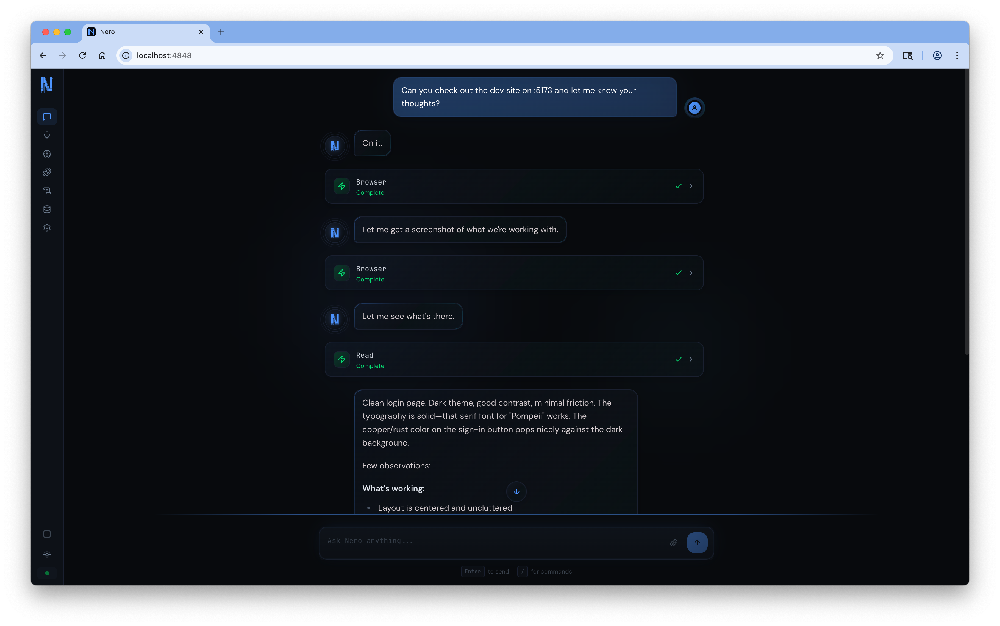

<p align="center">
  <strong>Your self-hosted AI that actually knows what's going on.</strong>
</p>

<p align="center">
  <a href="https://github.com/pompeii-labs/nero-oss/releases"></a>
  <a href="LICENSE"></a>
  <a href="https://github.com/pompeii-labs/nero-oss/stargazers"></a>
</p>

---

Nero is an open source AI companion that runs on your machine, connects to your tools via MCP, and thinks in the background while you're away. Talk to it through the terminal, web dashboard, iOS app, voice calls, or SMS.

**Why Nero?**
- **Self-hosted** - Your data stays on your machine. No cloud dependency.
- **Multi-interface** - CLI, web UI, voice, and SMS. Use what fits the moment.
- **Proactive** - Background thinking monitors your projects and surfaces insights.
- **MCP-native** - First-class Model Context Protocol support. Add any MCP server in seconds.

<p align="center">
  
</p>

## Install

```bash
# Install CLI
curl -fsSL https://raw.githubusercontent.com/pompeii-labs/nero-oss/main/install.sh | bash

# Create env file with your API key
mkdir -p ~/.nero
echo "OPENROUTER_API_KEY=your_key" > ~/.nero/.env

# Setup and start Docker
nero setup --compose
```

That's it. Nero is running at `http://localhost:4848`.

## Installation Modes

Nero supports two installation modes that control how much access it has to your host system:

### Integrated Mode (Default)

Full access to your host system. Use this for maximum capability.

```bash
nero setup --compose --integrated
```

| Capability | Description |
|------------|-------------|
| Host Filesystem | Read/write access to `~/` via `/host/home` |
| Docker | Can run docker commands on your host |
| Network | Uses host network for localhost access |

### Contained Mode

Sandboxed with no host access. Use this for untrusted tasks or demos.

```bash
nero setup --compose --contained
```

| Capability | Description |
|------------|-------------|
| Filesystem | Container-only, isolated volume |
| Docker | No access |
| Network | Isolated, port-mapped |

### Switching Modes

Re-run setup with the desired mode flag:

```bash
nero setup --compose --contained   # Switch to contained
nero setup --compose --integrated  # Switch to integrated
```

### Check Current Mode

```bash
nero status
```

## Update

```bash
nero update
```

This pulls the latest Docker image, restarts the container, and updates the CLI binary.

## Development

```bash
bun install
cp .env.example .env
# Edit .env with your OPENROUTER_API_KEY

# Optional: Start PostgreSQL
docker compose up db -d
bun run db:migrate

# Terminal 1: Service
bun run dev:service

# Terminal 2: CLI
bun run dev
```

## Configuration

Config lives at `~/.nero/config.json`. Add MCP servers:

```json
{
  "mcpServers": {
    "filesystem": {
      "command": "npx",
      "args": ["-y", "@modelcontextprotocol/server-filesystem", "/home/user"]
    },
    "github": {
      "command": "npx",
      "args": ["-y", "@modelcontextprotocol/server-github"],
      "env": {
        "GITHUB_PERSONAL_ACCESS_TOKEN": "your-token"
      }
    }
  }
}
```

Or use the CLI:

```bash
nero mcp add filesystem -- npx -y @modelcontextprotocol/server-filesystem ~/
nero mcp add github -- npx -y @modelcontextprotocol/server-github
nero mcp add remote-server https://mcp.example.com --transport http
nero mcp list
nero mcp remove filesystem
```

## Local Models (Ollama / vLLM)

Nero works with any OpenAI-compatible API, including local models via Ollama, vLLM, or similar.

### Quick Setup with Ollama

```bash
# Install Ollama (https://ollama.com)
ollama pull llama3.2:3b

# Point Nero at your Ollama instance
nero config set baseUrl http://localhost:11434/v1
nero config set model llama3.2:3b
```

Or edit `~/.nero/config.json` directly:

```json
{
  "settings": {
    "model": "llama3.2:3b",
    "baseUrl": "http://localhost:11434/v1"
  }
}
```

### Any OpenAI-Compatible Endpoint

Works with vLLM, TGI, LiteLLM, or any server that speaks the OpenAI chat completions API:

```bash
nero config set baseUrl http://your-server:8000/v1
nero config set model your-model-name
```

### Managing Models

```bash
nero models              # List available models from your provider
nero config get model    # Show current model
nero config get baseUrl  # Show current provider URL
```

### Reset to OpenRouter

```bash
nero config set baseUrl openrouter
```

> **Note:** Local models on CPU can be slow. For best results, use a GPU-accelerated setup. Nero automatically extends timeouts for local providers.

## Remote Access (Relay)

Nero supports **remote access** without exposing the core service to the public internet. A lightweight **relay** is tunneled instead, and the relay proxies only the allowed endpoints back to your local Nero instance.

### How It Works
- The tunnel points to the **relay** (default port `4849`)
- The relay forwards requests to your local Nero (`127.0.0.1:4848`)
- This keeps the main API private while still enabling remote use (Slack/SMS/Voice/iOS)

### Enable Relay Mode

```bash
nero relay start
nero license register   # one-time
```

This will:
- Enable online mode
- Start the tunnel to the relay
- Auto-register the tunnel URL in the backend

### Relay Commands

```bash
nero relay start     # Start relay + tunnel (always detached)
nero relay status    # Show relay/tunnel status
nero relay stop      # Stop relay/tunnel
```

> `nero tunnel` still works but is deprecated. Use `nero relay`.

## User Instructions (NERO.md)

Create `~/.nero/NERO.md` to customize Nero's behavior with persistent instructions:

```bash
echo "Always be concise. Prefer TypeScript over JavaScript." > ~/.nero/NERO.md
```

The file is loaded on startup and reloaded with `nero reload`. Use it for:

- Code style preferences
- Project context
- Response formatting rules
- Any persistent instructions

## CLI Commands

```bash
nero                      # Start interactive REPL
nero -m "message"         # One-shot message
nero config               # Show current configuration
nero config set <k> <v>   # Set a config value (model, baseUrl, etc.)
nero config get <key>     # Get a config value
nero models               # List available models from provider
nero status               # Show installation status and mode
nero setup                # Setup Docker container
nero setup --integrated   # Setup with full host access (default)
nero setup --contained    # Setup sandboxed, no host access
nero update               # Update to latest version
nero update --check       # Check for updates
nero reload               # Reload MCP servers and NERO.md
nero restart              # Restart the service container
nero migrate              # Run database migrations
```

## Slash Commands (REPL)

| Command | Description |
|---------|-------------|
| `/help` | Show available commands |
| `/exit` | Exit the REPL |
| `/clear` | Clear conversation history |
| `/compact` | Summarize and compress context |
| `/model` | Switch AI model |
| `/provider` | Switch API provider (base URL) |
| `/mcp` | List connected MCP servers and tools |
| `/memory` | Show stored memories |
| `/usage` | Show context usage |
| `/think` | Run background thinking manually |
| `/skills` | List available skills |

## Skills

Skills are reusable prompts that extend Nero's capabilities. They follow the [Agent Skills](https://skills.sh) standard.

```bash
# List installed skills
nero skills list

# Install from git repo
nero skills add user/repo

# Create your own
nero skills create my-skill

# Remove a skill
nero skills remove my-skill
```

Skills live in `~/.nero/skills/`. Each skill is a folder with a `SKILL.md` file:

```
~/.nero/skills/
  my-skill/
    SKILL.md
```

### Using Skills

In the web UI or REPL, type `/<skill-name>` to load a skill into context:

```
/my-skill          # Load skill
/my-skill          # Run again to unload
/skills            # List all skills (● = loaded)
```

Loaded skills stay active until you unload them or reload Nero.

### Creating Skills

```bash
nero skills create commit-helper
```

Edit `~/.nero/skills/commit-helper/SKILL.md`:

```yaml
---
name: commit-helper
description: Help write git commit messages
---

When the user asks you to commit, analyze the staged changes and suggest a clear, conventional commit message.
```

### Installing from npx skills

```bash
npx skills add vercel-labs/agent-skills --skill frontend-design --path ~/.nero/skills
```

## Background Thinking

Nero can think in the background while you're away.

```bash
nero think on              # Enable
nero think off             # Disable
nero think status          # Show settings
nero think notify on       # Enable urgent notifications
nero think destructive on  # Allow destructive actions (off by default)
nero think protect dev     # Add branch to protected list
```

When enabled, Nero waits 5 minutes after your last message, then checks git status, logs, MCP tools, etc. every 10 minutes. Thoughts are surfaced when you return.

## iOS App

A native iOS companion app is available in the `ios/` directory.

**Features:**
- Chat with markdown rendering and streaming
- Voice mode with real-time audio
- Memories management
- Connect via local network or remote tunnel

**Setup:**
1. Open `ios/Nero.xcodeproj` in Xcode
2. Update the bundle identifier and signing team
3. Build and run on your device
4. Enter your Nero server URL (e.g., `http://192.168.1.100:4848`)

For remote access, use your license key to connect via tunnel.

## Environment Variables

Add these to `~/.nero/.env`:

| Variable | Required | Description |
|----------|----------|-------------|
| `OPENROUTER_API_KEY` | Yes* | OpenRouter API key (*not needed with local models) |
| `DATABASE_URL` | No | PostgreSQL connection string |
| `TAVILY_API_KEY` | No | For web search tool |
| `DEEPGRAM_API_KEY` | No | For voice STT |
| `ELEVENLABS_API_KEY` | No | For voice TTS |
| `NERO_LICENSE_KEY` | No | For voice/SMS webhook routing |

## Voice, SMS & Slack (Optional)

Nero works fully without a license. The CLI, chat, and MCP tools all work out of the box.

A license unlocks voice calls, SMS, and Slack integration by routing webhooks through our infrastructure.

```bash
# Add to ~/.nero/.env
NERO_LICENSE_KEY=your_license_key
DEEPGRAM_API_KEY=your_key
ELEVENLABS_API_KEY=your_key

# Install cloudflared
brew install cloudflared

# Start tunnel
nero tunnel -d

# Register
nero license register
nero license status
```

Once registered, you can receive calls and texts at the phone number provided with your license.

## License

MIT
