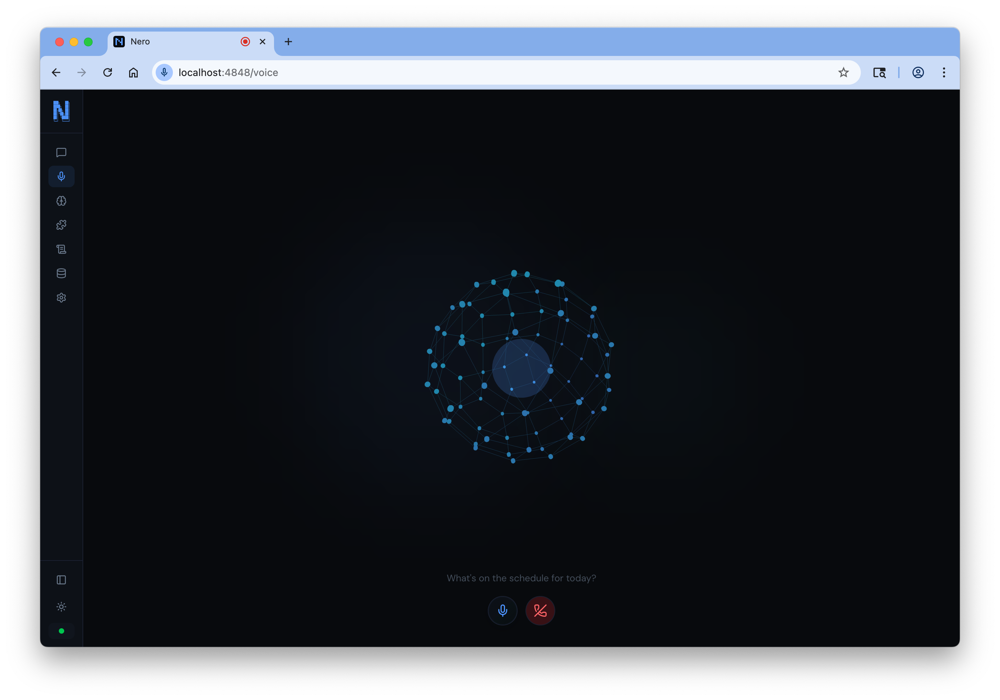
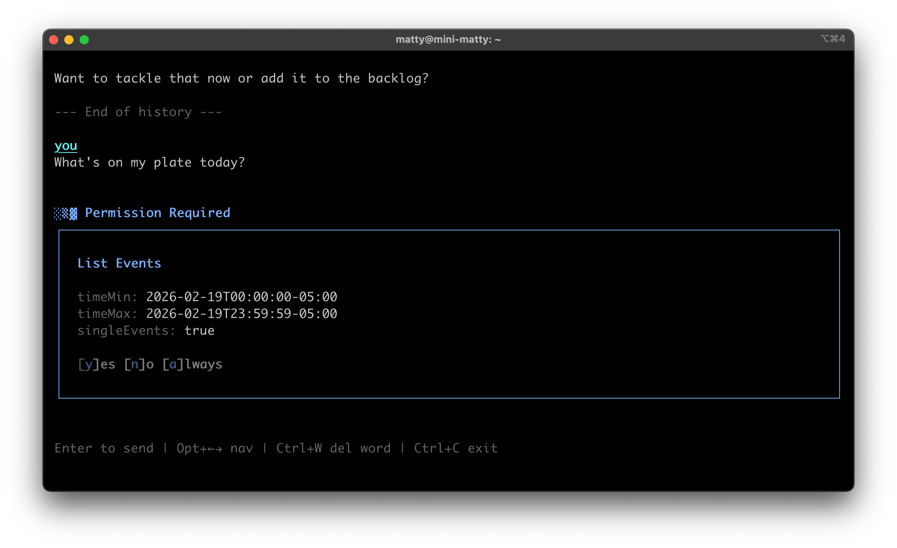
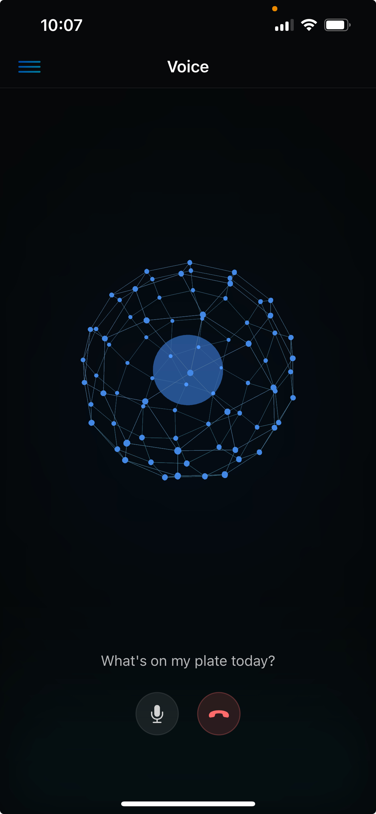

<p align="center">
  
</p>

<h1 align="center">Nero</h1>

<p align="center">
  <strong>The first AI agent with <em>agency</em>.</strong>
</p>

<p align="center">
  <a href="https://github.com/pompeii-labs/nero-oss/releases"></a>
  <a href="https://github.com/pompeii-labs/nero-oss/actions/workflows/ci.yml"></a>
  <a href="LICENSE"></a>
  <a href="https://github.com/pompeii-labs/nero-oss/stargazers"></a>
</p>

---

The closest thing to Jarvis you can self-host.

Nero is an AI that lives on your server. Call it, text it, Slack it, or open the terminal -- every interaction shares the same context, the same memory, the same thread. It knows what you talked about on a voice call when you message it later from the web dashboard. It works on its own projects while you sleep. It thinks in the background while you're away and tells you what it found when you get back.

Other AI agents are chatbots with plugins. Nero is one thing -- voice, terminal, web, SMS, and autonomy built together from the ground up.

<p align="center">
  
</p>

<p align="center">
  
</p>

<p align="center">
  
</p>

## Quick Start

```bash
curl -fsSL https://raw.githubusercontent.com/pompeii-labs/nero-oss/main/install.sh | bash

mkdir -p ~/.nero
echo "OPENROUTER_API_KEY=your_key" > ~/.nero/.env

nero setup --compose
```

That's it. Nero is running at `http://localhost:4848`.

## How You Interact With It

Nero isn't tied to one interface. Every medium shares the same conversation, memory, and context.

| Interface | What it is |
|-----------|------------|
| **Terminal** | Interactive REPL or one-shot commands via `nero -m "..."` |
| **Web Dashboard** | Chat, memories, logs, settings -- all in a self-hosted UI at `localhost:4848` |
| **Voice Calls** | Real phone calls with Deepgram STT, ElevenLabs/Hume TTS, and real-time emotion detection |
| **SMS** | Text it from your phone, get responses back |
| **iOS App** | Native SwiftUI app with chat, voice mode, and memory management |
| **Slack** | Message it in Slack with rich Block Kit responses |
| **API** | REST + SSE streaming for custom integrations |

## What Makes Nero Different

### Unified Context Across Every Interface

Talk to Nero on a voice call, then text it, then open the web dashboard. It remembers everything across every medium. There's no "Slack bot" and "CLI tool" -- it's one agent with one memory.

### Autonomy Mode

Nero doesn't just respond. It can work on its own projects while you're away -- tracking progress, writing journal entries, and managing its own token budget. This isn't a cron job. It's an agent that decides what to work on, does the work, and picks up where it left off next session.

```bash
nero autonomy on
nero autonomy status
nero autonomy budget 500000
```

### Background Thinking

When you step away, Nero watches your environment -- git status, logs, MCP tools -- and surfaces what it finds when you come back. Optional Slack notifications for anything urgent.

```bash
nero think on
nero think notify on
```

### Emotion Detection

During voice calls, Nero analyzes vocal prosody in real-time via Hume's Expression Measurement API (48 dimensions). It knows how you're feeling and adjusts its responses accordingly. No other open-source agent does this.

### MCP-Native

First-class Model Context Protocol support. Add any MCP server in seconds -- stdio or HTTP, with OAuth support for remote servers.

```bash
nero mcp add filesystem -- npx -y @modelcontextprotocol/server-filesystem ~/
nero mcp add github -- npx -y @modelcontextprotocol/server-github
nero mcp add remote-server https://mcp.example.com --transport http
```

### Browser Automation

Built-in Playwright for web automation -- navigate, click, type, screenshot, run JavaScript. Cookie banners dismissed automatically.

### Scheduled Actions

Schedule recurring tasks -- daily, weekly, monthly, or on any interval. Nero executes them autonomously.

### Skills

Extend Nero with reusable prompts that follow the [Agent Skills](https://skills.sh) standard.

```bash
nero skills add user/repo
nero skills create my-skill
```

### Hooks

Run shell commands at key lifecycle points -- block dangerous tool calls, log everything, inject custom workflows.

```json
{
  "hooks": {
    "PreToolUse": [{ "command": "~/.nero/hooks/block-rm.sh", "match": "bash" }]
  }
}
```

Seven events: `PreToolUse`, `PostToolUse`, `OnPrompt`, `OnResponse`, `OnMainFinish`, `OnError`, `OnSessionStart`.

### Subagent Dispatch

Spawn parallel agents for independent research or build tasks. Each runs in isolation with its own model and context.

## Architecture

```
┌─────────────────────────────────────────┐
│              Relay (:4848)              │
│         Single entry point             │
│     Auth when license key is set       │
├─────────────────────────────────────────┤
│            Service (:4847)             │
│                                         │
│  ┌─────────┐ ┌─────────┐ ┌──────────┐ │
│  │  Agent   │ │   MCP   │ │  Tools   │ │
│  │ (Magma)  │ │ Servers │ │ (30+)    │ │
│  └─────────┘ └─────────┘ └──────────┘ │
│                                         │
│  ┌─────────┐ ┌─────────┐ ┌──────────┐ │
│  │  Voice   │ │   SMS   │ │  Slack   │ │
│  │ (Twilio) │ │(Twilio) │ │(Webhook) │ │
│  └─────────┘ └─────────┘ └──────────┘ │
│                                         │
│  ┌─────────┐ ┌─────────┐ ┌──────────┐ │
│  │ Browser  │ │Autonomy │ │Background│ │
│  │(Playwrt) │ │ Engine  │ │ Thinking │ │
│  └─────────┘ └─────────┘ └──────────┘ │
├─────────────────────────────────────────┤
│           PostgreSQL                    │
└─────────────────────────────────────────┘
```

The relay always runs on port `4848` as the single entry point. The internal service on `127.0.0.1:4847` is never exposed directly. Without a license key, the relay is an open passthrough. With one, it enforces auth for non-private IPs.

## Deployment

### Docker (Recommended)

```bash
nero setup --compose --integrated    # Full host access (default)
nero setup --compose --contained     # Sandboxed, no host access
nero status                          # Check current mode
nero update                          # Pull latest image + restart
```

**Integrated mode** gives Nero access to your host filesystem (`~/`), Docker, and network. **Contained mode** sandboxes everything.

### Local Models

Works with Ollama, vLLM, or any OpenAI-compatible API.

```bash
nero config set baseUrl http://localhost:11434/v1
nero config set model llama3.2:3b
```

### Remote Access

```bash
nero relay start         # Start tunnel to relay
nero license register    # One-time webhook registration
nero relay status        # Check tunnel status
```

Access Nero from anywhere. The tunnel connects to the relay, and the license key handles auth.

## Configuration

All config lives at `~/.nero/config.json`. Persistent instructions go in `~/.nero/NERO.md`.

### Environment Variables

Add to `~/.nero/.env`:

| Variable | Required | Description |
|----------|----------|-------------|
| `OPENROUTER_API_KEY` | Yes* | OpenRouter API key (*not needed with local models) |
| `DATABASE_URL` | No | PostgreSQL connection string |
| `TAVILY_API_KEY` | No | Web search tool |
| `DEEPGRAM_API_KEY` | No | Voice STT |
| `ELEVENLABS_API_KEY` | No | Voice TTS (ElevenLabs) |
| `HUME_API_KEY` | No | Voice TTS (Hume) and emotion detection |
| `NERO_LICENSE_KEY` | No | Voice/SMS webhook routing |

### Voice, SMS & Slack

Nero works fully without a license. The CLI, web dashboard, and MCP tools all work out of the box.

A license unlocks voice calls, SMS, and Slack by routing webhooks through Pompeii's infrastructure. Once registered, you get a phone number for calls and texts.

```bash
nero license register
nero license status
```

## CLI Reference

```bash
nero                      # Interactive REPL
nero -m "message"         # One-shot message
nero chat                 # Start REPL (alias)
nero config               # Show config
nero config set <k> <v>   # Set config value
nero models               # List available models
nero status               # Installation status
nero setup --compose      # Setup Docker
nero update               # Update to latest
nero reload               # Reload MCP servers, skills, NERO.md
nero restart              # Restart service
nero logs                 # View recent logs
nero logs -f              # Stream logs in real-time
nero mcp list             # List MCP servers
nero mcp add <name> ...   # Add MCP server
nero skills list          # List skills
nero think on/off         # Toggle background thinking
nero autonomy on/off      # Toggle autonomy mode
nero relay start          # Start tunnel
```

## Development

```bash
bun install
cp .env.example .env

docker compose up db -d
bun run db:migrate

bun run dev:service      # Terminal 1: Service
bun run dev              # Terminal 2: CLI
bun test                 # Run tests
```

## iOS App

Native SwiftUI companion app with chat, voice mode with the neural sphere, memory management, live log streaming, and MCP server management.

<p align="center">
  
</p>

### Setup

```bash
cd ios
cp Signing.xcconfig.template Signing.xcconfig
```

Edit `Signing.xcconfig` with your Apple Developer Team ID and bundle identifier:

```
DEVELOPMENT_TEAM = YOUR_TEAM_ID
PRODUCT_BUNDLE_IDENTIFIER = com.yourorg.nero
CODE_SIGN_STYLE = Automatic
```

Open `ios/Nero.xcodeproj` in Xcode, build and run. On first launch, go to Settings and enter your Nero server URL (e.g., `http://192.168.1.100:4848`).

Requires iOS 17+ and Xcode 15+.

## License

MIT
