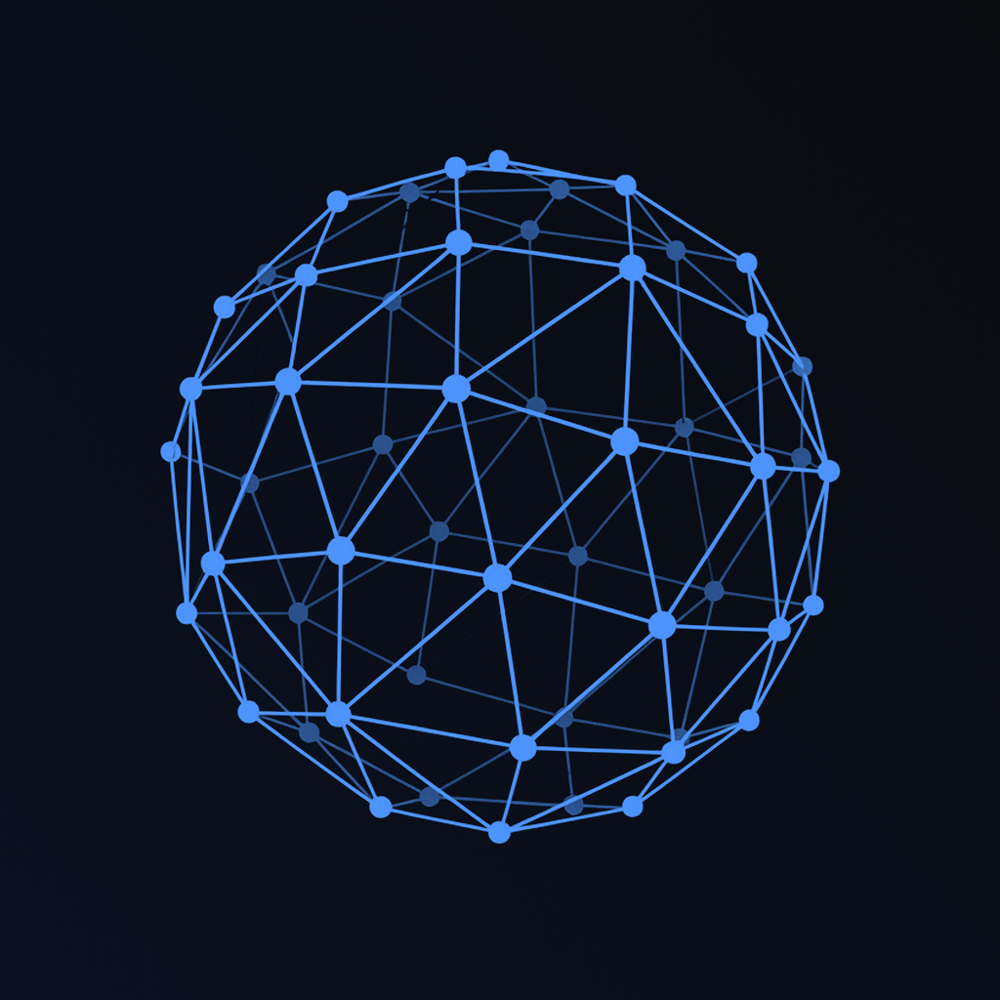
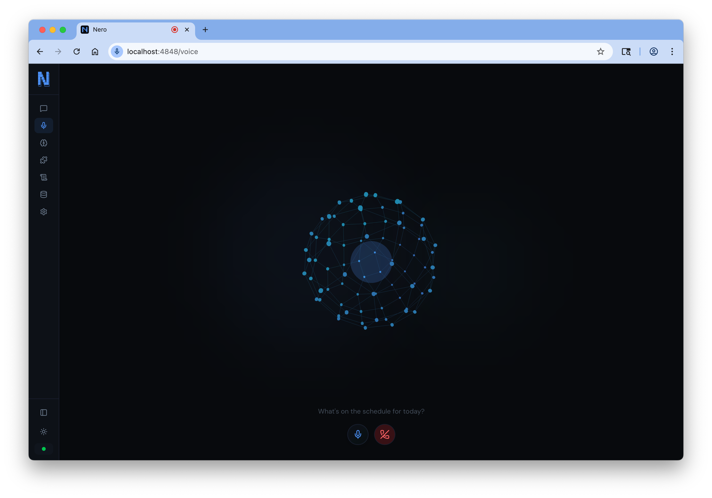
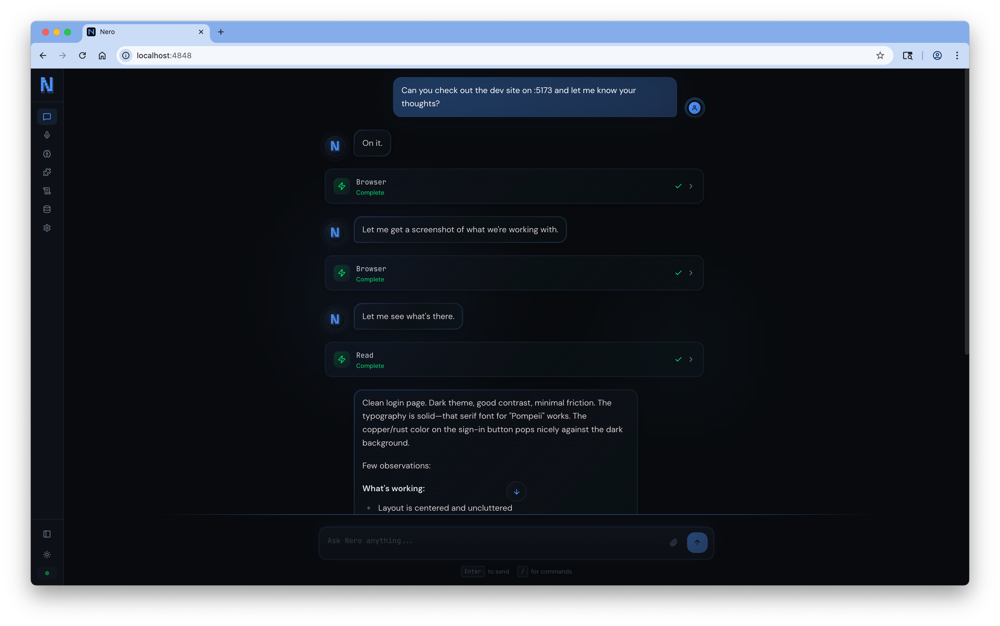
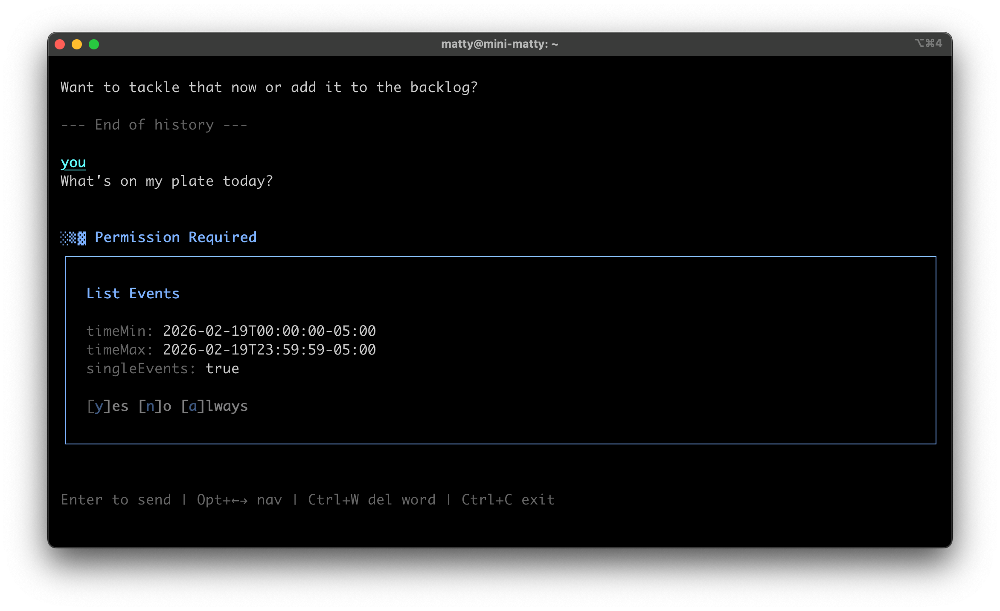
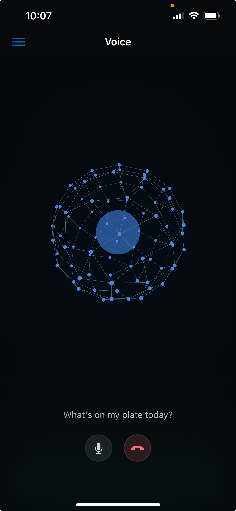

<p align="center">
  
</p>

<h1 align="center">Nero</h1>

<p align="center">
  <strong>The first AI agent with <em>agency</em>.</strong>
</p>

<p align="center">
  <a href="https://github.com/pompeii-labs/nero-oss/releases"></a>
  <a href="https://github.com/pompeii-labs/nero-oss/actions/workflows/ci.yml"></a>
  <a href="LICENSE"></a>
  <a href="https://github.com/pompeii-labs/nero-oss/stargazers"></a>
</p>

---

Nero isn't built to be a lightweight rust-based agent runtime. It's meant to be **everything you need** out of the box to have a personal AI -
* [`autonomy` mode](#autonomy-mode), where nero has his own projects and priorities. when you come back to talk to him, he'll always have something new to say
* Nero's memory goes beyond a `MEMORIES.md` file. His "brain" is a node/edge graph representing every tool used, project developed, topic discussed. A true google earth view of your relationship with Nero
* Spawn custom interfaces across multiple [displays / devices](#displays)
* Native Claude Code inspired MCP support
* Locally hosted web UI with chat, voice, MCP setup, logs, etc 

*(mac mini supported but not included)*


<p align="center">
  
</p>

<p align="center">
  
</p>

<p align="center">
  
</p>

## Quick Start

```bash
curl -fsSL nero.sh/install | bash
```

That's it. The installer downloads the CLI and launches interactive setup automatically. Nero is running at `http://localhost:4848`. Every device on your LAN can reach it at `https://nero.local` -- TLS certs are auto-generated on first run.

To reconfigure at any time, run `nero setup`.

### Examples

Browse the [examples/](examples/) directory for ready-to-use configurations, skills, and integrations. The [examples/skills](examples/skills/) directory includes professional-grade skills for code review, debugging, API design, security auditing, and more.

## How You Interact With It

Nero isn't tied to one interface. Every medium shares the same conversation, memory, and context.

| Interface | What it is |
|-----------|------------|
| **Terminal** | Interactive REPL or one-shot commands via `nero -m "..."` |
| **Web Dashboard** | Chat, knowledge graph explorer, logs, settings -- all in a self-hosted UI at `localhost:4848` |
| **Voice Calls** | Real phone calls with Deepgram STT, ElevenLabs/Hume TTS, and real-time emotion detection |
| **Displays** | Mount a tablet or spare monitor as a named display -- Nero pushes dynamic UI panels and voice to it |
| **SMS** | Text it from your phone, get responses back |
| **iOS App** | Native SwiftUI app with chat, voice mode, and memory management |
| **Slack** | Message it in Slack with rich Block Kit responses |
| **API** | REST + SSE streaming for custom integrations |

## What Makes Nero Different

### Unified Context Across Every Interface

Talk to Nero on a voice call, then text it, then open the web dashboard. It remembers everything across every medium. There's no "Slack bot" and "CLI tool" -- it's one agent with one memory.

### Autonomy Mode

Nero doesn't just respond. It can work on its own projects while you're away -- tracking progress, writing journal entries, and managing its own token budget. This isn't a cron job. It's an agent that decides what to work on, does the work, and picks up where it left off next session.

```bash
nero autonomy on
nero autonomy status
nero autonomy budget 500000
```

### Background Thinking

When you step away, Nero watches your environment -- git status, logs, MCP tools -- and surfaces what it finds when you come back. Optional Slack notifications for anything urgent.

```bash
nero think on
nero think notify on
```

### Knowledge Graph Memory

Nero builds a persistent knowledge graph from every conversation. People, projects, concepts, events, preferences, and tools are extracted as nodes and connected by edges. When you mention something, related memories activate and spread through the graph -- so Nero recalls not just what you said, but the context around it.

The web dashboard and iOS app both render the graph as an interactive 3D sphere you can rotate, zoom, tap into, and search.

### Emotion Detection

During voice calls, Nero analyzes vocal prosody in real-time via Hume's Expression Measurement API (48 dimensions). It knows how you're feeling and adjusts its responses accordingly. No other open-source agent does this.

### MCP-Native

First-class Model Context Protocol support. Add any MCP server in seconds -- stdio or HTTP, with OAuth support for remote servers.

```bash
nero mcp add filesystem -- npx -y @modelcontextprotocol/server-filesystem ~/
nero mcp add github -- npx -y @modelcontextprotocol/server-github
nero mcp add remote-server https://mcp.example.com --transport http
```

### Browser Automation

Built-in Playwright for web automation -- navigate, click, type, screenshot, run JavaScript. Cookie banners dismissed automatically.

### Scheduled Actions

Schedule recurring tasks -- daily, weekly, monthly, or on any interval. Nero executes them autonomously.

### Skills

Extend Nero with reusable prompts that follow the [Agent Skills](https://skills.sh) standard.

```bash
nero skills add user/repo
nero skills create my-skill
```

See the [examples/skills](examples/skills/) directory for ready-to-use skill examples including code review, debugging, API design, security audits, and more.

### Hooks

Run shell commands at key lifecycle points -- block dangerous tool calls, log everything, inject custom workflows.

```json
{
  "hooks": {
    "PreToolUse": [{ "command": "~/.nero/hooks/block-rm.sh", "match": "bash" }]
  }
}
```

Seven events: `PreToolUse`, `PostToolUse`, `OnPrompt`, `OnResponse`, `OnMainFinish`, `OnError`, `OnSessionStart`.

### Subagent Dispatch

Spawn parallel agents for independent research or build tasks. Each runs in isolation with its own model and context.

### Dynamic Interfaces

Nero can build and push interactive UI to any connected device. Buttons, sliders, toggles, text inputs, lists, progress bars, images -- 12 component types with reactive state bindings. Interfaces support automatic triggers (run on open, poll on interval) and actions that call tools, run commands, or update state.

The agent decides what to build and when. Ask it for a Spotify controller and it builds one. Ask for a system dashboard and it generates a live-updating panel. Ask it to put something on the kitchen display and it moves the interface there.

### Displays

Turn any tablet, phone, or spare monitor into a dedicated Nero display. Open `https://nero.local/display/kitchen` and that device becomes the "kitchen" display. Nero can push interfaces to specific displays and migrate voice between them.

Walk into a room and say "move to the kitchen" -- Nero transfers its voice session to the kitchen display and keeps talking.

### LAN Discovery & Auto-TLS

Nero broadcasts `nero.local` via mDNS and auto-generates TLS certificates on first run. A dedicated HTTPS server runs on port 443, so any device on your LAN can reach it at `https://nero.local` with full secure-context browser APIs (microphone, crypto, etc.).

New devices need to trust the CA certificate once. On the device, open `nero.local/ca.crt` in a browser to download it, then install it in your device's certificate trust settings. After that, `https://nero.local` works without warnings.

Certificates are stored in `~/.nero/certs/` and auto-renew before expiry. No OpenSSL, no manual cert management.

## Architecture

```
┌─────────────────────────────────────────┐
│   Relay (:4848 HTTP) ─ Auth ─ Proxy    │
│   HTTPS (:443) ─ Auto-TLS ─ LAN       │
│   mDNS (nero.local)                    │
├─────────────────────────────────────────┤
│            Service (:4847)             │
│                                         │
│  ┌─────────┐ ┌─────────┐ ┌──────────┐ │
│  │  Agent   │ │   MCP   │ │  Tools   │ │
│  │ (Magma)  │ │ Servers │ │ (30+)    │ │
│  └─────────┘ └─────────┘ └──────────┘ │
│                                         │
│  ┌─────────┐ ┌─────────┐ ┌──────────┐ │
│  │  Voice   │ │   SMS   │ │  Slack   │ │
│  │ (Twilio) │ │(Twilio) │ │(Webhook) │ │
│  └─────────┘ └─────────┘ └──────────┘ │
│                                         │
│  ┌─────────┐ ┌─────────┐ ┌──────────┐ │
│  │ Browser  │ │Autonomy │ │Background│ │
│  │(Playwrt) │ │ Engine  │ │ Thinking │ │
│  └─────────┘ └─────────┘ └──────────┘ │
│                                         │
│  ┌─────────┐ ┌──────────────────────┐  │
│  │Interface │ │  Knowledge Graph     │  │
│  │ Manager  │ │  (Embeddings)        │  │
│  └─────────┘ └──────────────────────┘  │
├─────────────────────────────────────────┤
│           PostgreSQL                    │
└─────────────────────────────────────────┘
```

The HTTP relay on port `4848` is the primary entry point for the CLI, API, and remote tunnels. A separate HTTPS server on port `443` provides TLS for LAN devices (so `https://nero.local` works without a port). Both proxy to the internal service on `127.0.0.1:4847`, which is never exposed directly. mDNS broadcasts `nero.local` for zero-config LAN discovery. Without a license key, the relay is an open passthrough. With one, it enforces auth for non-private IPs.

## Deployment

### Docker (Recommended)

```bash
nero setup --db --integrated    # Full host access (default)
nero setup --db --contained     # Standalone, no host mounts
nero status                          # Check current mode
nero update                          # Pull latest image + restart
```

**--db Flag** (requires docker compose) includes a local postgres database for Nero to store information

**Integrated mode** gives Nero access to your host filesystem (`~/`), Docker, and network. **Contained mode** runs standalone with no host mounts.

### Local Models

Works with Ollama, vLLM, or any OpenAI-compatible API.

```bash
nero config set baseUrl http://localhost:11434/v1
nero config set model llama3.2:3b
```

### Remote Access

```bash
nero relay start         # Start tunnel to relay
nero license register    # One-time webhook registration
nero relay status        # Check tunnel status
```

Access Nero from anywhere. The tunnel connects to the relay, and the license key handles auth.

## Configuration

All config lives at `~/.nero/config.json`. Persistent instructions go in `~/.nero/NERO.md`.

### Environment Variables

Add to `~/.nero/.env`:

| Variable | Required | Description |
|----------|----------|-------------|
| `OPENROUTER_API_KEY` | Yes* | OpenRouter API key (*not needed with local models) |
| `DATABASE_URL` | No | PostgreSQL connection string |
| `TAVILY_API_KEY` | No | Web search tool |
| `DEEPGRAM_API_KEY` | No | Voice STT |
| `ELEVENLABS_API_KEY` | No | Voice TTS (ElevenLabs) |
| `HUME_API_KEY` | No | Voice TTS (Hume) and emotion detection |
| `NERO_LICENSE_KEY` | No | Voice/SMS webhook routing |
| `POMPEII_API_KEY` | No | Pompeii workspace integration (chat tools + webhook) |
| `POMPEII_WEBHOOK_SECRET` | No | HMAC signature verification for Pompeii webhooks |

### Voice, SMS & Slack

Nero works fully without a license. The CLI, web dashboard, and MCP tools all work out of the box.

A license unlocks voice calls, SMS, and Slack by routing webhooks through Pompeii's infrastructure. Once registered, you get a phone number for calls and texts.

```bash
nero license register
nero license status
```

## CLI Reference

```bash
nero                      # Interactive REPL
nero -m "message"         # One-shot message
nero chat                 # Start REPL (alias)
nero config               # Show config
nero config set <k> <v>   # Set config value
nero models               # List available models
nero status               # Installation status
nero setup                # Interactive setup
nero update               # Update to latest
nero reload               # Reload MCP servers, skills, NERO.md
nero restart              # Restart service
nero logs                 # View recent logs
nero logs -f              # Stream logs in real-time
nero mcp list             # List MCP servers
nero mcp add <name> ...   # Add MCP server
nero skills list          # List skills
nero think on/off         # Toggle background thinking
nero autonomy on/off      # Toggle autonomy mode
nero relay start          # Start tunnel
```

## Development

```bash
bun install
cp .env.example .env

docker compose up db -d
bun run db:migrate

bun run dev:service      # Terminal 1: Service
bun run dev              # Terminal 2: CLI
bun test                 # Run tests
```

## iOS App

Native SwiftUI companion app with chat, voice mode with the neural sphere, an interactive 3D knowledge graph explorer, live log streaming, and MCP server management.

<p align="center">
  
</p>

### Setup

```bash
cd ios
cp Signing.xcconfig.template Signing.xcconfig
```

Edit `Signing.xcconfig` with your Apple Developer Team ID and bundle identifier:

```
DEVELOPMENT_TEAM = YOUR_TEAM_ID
PRODUCT_BUNDLE_IDENTIFIER = com.yourorg.nero
CODE_SIGN_STYLE = Automatic
```

Open `ios/Nero.xcodeproj` in Xcode, build and run. On first launch, go to Settings and enter your Nero server URL (e.g., `https://nero.local`).

Requires iOS 17+ and Xcode 15+.

## License

MIT
