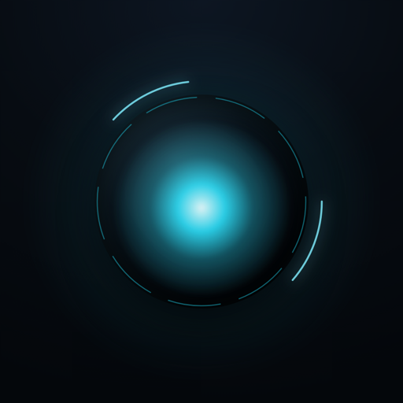

<p align="center">
  
</p>

<h1 align="center">Nero</h1>

<p align="center">
  <strong>A self-hosted AI companion that lives on your hardware.</strong>
</p>

<p align="center">
  <a href="https://github.com/pompeii-labs/nero-oss/releases"></a>
  <a href="https://github.com/pompeii-labs/nero-oss/actions/workflows/ci.yml"></a>
  <a href="LICENSE"></a>
  <a href="https://github.com/pompeii-labs/nero-oss/stargazers"></a>
</p>

---

Nero is a single-user AI companion you run yourself. No account, no cloud tenant, no
per-seat billing. It runs as a small stack on a machine you own (a Mac Mini, a home
server, a spare box) and you reach it from the web, your phone, and voice. One agent,
one memory, one presence, across every surface.

It is closer to Jarvis than to a chatbot: something that is *around*, that you talk to
by voice or text, that can act on the world, work on things in the background, and show
up on whatever screen you are near.

## Quick start

```bash
curl -fsSL https://raw.githubusercontent.com/pompeii-labs/nero-oss/main/install.sh | bash
nero start
```

The installer drops the `nero` binary in your `PATH`. `nero start` pulls the images,
provisions TLS, and brings the stack up at `http://localhost` (and `https://localhost`
for voice). Put your `OPENROUTER_API_KEY` in `~/.nero/.env` so Nero can think, then
`nero restart`. Update anytime with `nero update`.

Needs Docker. That is the only host dependency.

## Why

Most "AI agents" are a chat box in front of someone else's server. Nero is the opposite
bet:

- **You own it.** It runs on your hardware, against your files, with your keys. Your
  conversations and memory live in a local database you can back up and move. Nothing is
  someone else's tenant.
- **It is one being, not one interface.** The same agent, memory, and context are shared
  across voice, text, and every display you put it on. There is no separate app per
  surface. You talk to Nero; the surface is just where you happened to be.
- **It is present.** Nero is a single orb that lives on one screen at a time. Walk up to
  a different device and summon it there. Talk by voice or type, they are two modes of the
  same presence, not two apps.
- **It can act.** Browser automation, MCP tools, scheduled actions, and background
  projects that write real code against real repos. It does work, not just answers.

## How it works

`nero start` fuses four containers plus a host-side runner, managed by a thin CLI:

```
  web          nginx. Serves the web UI and is the single origin. Proxies /v1 to the
               api and /lux to the engine (HTTP + the realtime WebSocket).
  api          Bun. The agent, mediums, background projects, MCP, and voice signaling.
  lux          The backend: tables, KV, vectors, realtime, queues, and auth - one engine.
  media        A small Rust WebRTC sidecar for voice (Opus <-> PCM, str0m).
  host-runner  A daemon on the host (not a container) that the api proxies filesystem,
               git, and shell ops to, so code projects run against real repos + toolchains.
```

The web UI has two planes. The **Field** (`/`) is Nero's space: the orb, voice,
conversation, and the panels it throws onto your screen, no admin chrome. The **Workshop**
is your space: mediums, memories, MCP, logs, and settings, the workbench where you inspect
and configure. You never talk to a database or a config file directly; the CLI writes
desired state and the stack reconciles.

## Design decisions

### One backend: Lux

A self-hosted appliance should not make you run and operate Postgres *and* Redis *and* a
vector store *and* a realtime/pubsub layer *and* an auth system. That is five moving parts
to install, secure, back up, and reason about, for one person.

Nero uses [Lux](https://luxdb.dev) instead: a single engine that is tables, KV, vectors,
realtime subscriptions, a job queue, and auth at once. It speaks the Redis protocol (so
the background-project queue runs on it directly), exposes an HTTP SDK, and pushes realtime
changes to the browser. The whole persistence story is one container and one volume. Back
Nero up by tarring that volume; move it by moving the volume. That is why the stack is four
small services instead of a dozen.

### An appliance, driven by a thin CLI

The `nero` CLI never serves anything. It is a host-side manager over docker-compose in
`~/.nero`, modeled on the Lux CLI. It generates the compose file and environment, pulls the
published images, and brings them up; the containers do the work. `~/.nero/.env` is treated
as sacred, the CLI only ever appends missing keys, it never edits or removes what you put
there. `nero start`, `stop`, `status`, `doctor`, `restore`, `cert`, `update`.

### Code runs on the host: the host-runner

Nero can write code, background projects that plan, edit real repositories, run tests, and
open PRs. Code needs real toolchains, `git`, `gh`, and the actual filesystem, none of which
belong locked inside a hardened container. So a small daemon runs those operations on the
host, and the containerized api proxies filesystem/exec/git calls to it over an
authenticated HTTP surface. In local dev the exact same interface runs in-process. The
containers stay lean; the messy, powerful work happens where it should.

### One origin

The browser talks to a single origin. nginx serves the SPA, proxies `/v1` to the api, and
proxies `/lux` (HTTP and the realtime WebSocket) to the engine. Because the app uses
relative URLs, it works identically from `localhost`, a LAN IP, or a domain, with no CORS,
no per-deploy URL configuration, and no second port a client has to reach. This is what
makes it just work whether you open it on the host or on your phone.

### Local HTTPS + mDNS, so voice works off localhost

Microphone access and other browser APIs require a *secure context*, which off `localhost`
means HTTPS. On first run Nero provisions a local certificate authority and a short-lived
leaf and serves port 443; visiting `nero.local/cert.crt` (or `<ip>/cert.crt`) installs the
CA so a device trusts it once. It advertises `nero.local` over mDNS. After that, voice works
in the browser on any device on your network. No OpenSSL, no manual cert management.

### Presence, not a chat window

Nero is a single entity. The orb renders on exactly one screen at a time; from any other
device you summon it. Voice and text are two modes of the same presence, tap the orb to
talk, type to chat, and it is one continuous conversation either way. The web app is an
installable PWA, so on a phone it is a real home-screen app.

## What it does

- **Voice.** Real-time conversation with a cascaded pipeline (Deepgram STT, a fast LLM,
  ElevenLabs TTS) over the Rust WebRTC sidecar, with barge-in. Works in the browser on any
  device on your LAN over HTTPS.
- **Background projects.** Nero plans a multi-step project, you approve, and it executes in
  the background, spawning subagents, writing and testing code in isolated git worktrees,
  and reporting back when done.
- **Knowledge-graph memory.** People, projects, concepts, and events are extracted as nodes
  and connected by edges. Mentioning something activates related memories through the graph.
- **Mediums.** Surfaces are first-class, pluggable modules that share one conversation and
  memory (web, voice, and displays today; more are just modules). Nero reaches you where
  you are by urgency and presence.
- **MCP-native.** Add any Model Context Protocol server (stdio or HTTP, with OAuth) in
  seconds.
- **Displays + panels.** Mount a tablet or spare monitor as a named display; Nero throws
  interactive UI panels onto it and can move its voice session between rooms.
- **Mobile.** Installable PWA with the responsive Field, add it to your home screen.

## Development

Monorepo (bun workspaces): `api/` (server), `web/` (SvelteKit), `cli/` (the `nero`
binary + host-runner), `shared/` (`@nero/shared`), `media/` (Rust WebRTC sidecar),
`lux/` (migrations).

```bash
bun install
cp .env.example .env        # fill in OPENROUTER_API_KEY etc.

lux start                   # local Lux engine (the data layer)
cd api && bun run dev       # terminal 1: the server
cd web && bun run dev       # terminal 2: the web UI

cd api && bun run test      # tests
```

`nero start` runs the full containerized stack. `nero doctor` inspects it. Lux data lives
in a Docker volume; `nero restore <backup.tgz>` seeds the bundled engine from a backup.

## License

MIT
